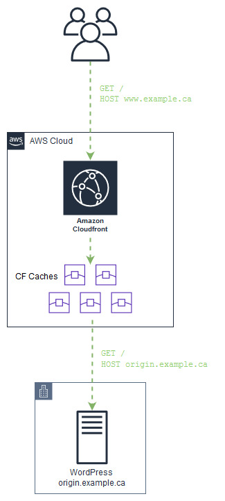

## Amazon CloudFront for WordPress as Infrastructure as Code

These [Terraform](https://www.terraform.io/) manifests will instantiate the
following services for use with WordPress:

- [Amazon CloudFront](https://aws.amazon.com/cloudfront/)
- [Amazon S3](https://aws.amazon.com/s3) (for storing CloudFront logs)

The assumed architecture is such:



### Prerequisites

##### SSL Certificate

The Terraform manifests don't do 100% of what's needed to make this work.
There's one thing that needs to be done manually: requesting an SSL certificate
for CloudFront

The easiest way to get a certificate into CloudFront is to use the
[AWS Certificate Manager](https://aws.amazon.com/certificate-manager) (ACM)
service.  After the initial setup, ACM will take care of renewals for you as
well as sharing the certificate and private key with your CloudFront
distribution.

Follow the
"[Request a Public Certificate](https://docs.aws.amazon.com/acm/latest/userguide/gs-acm-request-public.html)"
chapter in the ACM documentation to get your certificate. NOTE: In order for
CloudFront to use this certificate, you must use ACM in the **us-east-1** (N.
Virginia) region.

##### Credentials File

If you don't already have one, create an IAM user that has administrator
privileges to CloudFront and S3.

Create your
[AWS shared credentials file](https://aws.amazon.com/blogs/security/a-new-and-standardized-way-to-manage-credentials-in-the-aws-sdks/) using one of these two methods:

1. With the AWS CLI installed, `aws configure` or if you want to create a
   unique profile, `aws configure --profile blogadmin` (or
   whatever profile name you like).
2. Manually by following the instructions in this
   [AWS blog post](https://aws.amazon.com/blogs/security/a-new-and-standardized-way-to-manage-credentials-in-the-aws-sdks/).

### Installation

- Clone or download this Git repo using the **Clone or download** button in GitHub when viewing the repo.
- Install Terraform using your operating system's package management tools or
[download and install](https://www.terraform.io/downloads.html) a binary
directly from the Terraform site.
- With Terraform installed and properly in your PATH, execute `terraform init`
from the directory that contains the `.tf` files in this repo.

### Configuration

Create `terraform.tfvars` and set the required variables. Run
`terraform plan` to see a list of variables that need to be set and refer
to the information below for details about what each variable is used for.

##### Mandatory

These variables must be defined in `terraform.tfvars`:

- `acm_cert_arn`

	The ARN of the SSL certificate you generated for CloudFront in ACM.

	Default: *none*

	Example: `acm_cert_arn = "arn:aws:acm:us-east-1:12345678900:certificate/6aedf7d4-32e1-4437-a427-6eeb45e583b5"`

- `aws_region`

	The AWS region in which to create resources.

	Default: *none*

	Example: `aws_region = "us-west-2"`

- `blog_domain_names`

	A list of domain names by which your blog is known. For example, if
	your blog is `www.example.ca` but is also reachable via `example.ca`,
	both domains should be specified in this setting.

	Default: *none*

	Example:
	```
	blog_domain_names = [
		"example.ca",
		"www.example.ca"
	]
	```

	If your blog is only known via a single domain name:
	`blog_domain_names = [ "www.example.ca" ]`

- `origin_domain_name`

	The domain name of the origin server where the blog is actually hosted.

	Default: *none*

	Example: `origin_domain_name = "origin.example.ca"`

- `cf_logging_bucket_name`

	The S3 bucket that CloudFront will be configured to log to. The bucket
	will be created if it doesn't already exist.

	Default: *none*

	Example: `cf_logging_bucket_name = "exampleca-logs"`

##### Optional

These settings have sane defaults and are not required in `terraform.tfvars`:

- `aws_profile`

	The name of the profile to use from the
	[AWS shared credentials file](https://aws.amazon.com/blogs/security/a-new-and-standardized-way-to-manage-credentials-in-the-aws-sdks/).

	Default: "default"

	Example: `aws_profile = "blogadmin"`

- `cf_logging_bucket_prefix`

	The prefix that CloudFront should use when storing logs in the logging
	bucket.

	Default: *no prefix used*

	Example: `cf_logging_bucket_prefix = "cloudfront/"`

- `cf_default_ttl`
- `cf_max_ttl`

	The default time-to-live (TTL) values that CloudFront will apply to
	assets such as the main index, posts, and pages. This TTL does not
	apply to the admin UI (`wp-admin/`), the core WordPress objects
	(`wp-includes/`), or themes and plugins (`wp-content/`).

	`cf_default_ttl` is the TTL that's applied when no other TTL is
	evident (e.g., no `Cache-Control` header is present).

	Default: 3600 seconds

	Example: `cf_default_ttl = 60` (seconds)

	`cf_max_ttl` is the upper limit on the TTL; CloudFront will cap the TTL
	to this value in the case that WordPress sends back a `Cache-Control`
	header.

	Default: 86400 seconds (24 hours)

	Example: `cf_max_ttl = 3600` (1 hour)

- `cf_origin_id`

	The CloudFront origin ID. This is a friendly name that's configured in
	CloudFront for the origin.

	Default: `blogOrigin`

	Example: `cf_origin_id = "exampleBlogOrigin"`

- `wp_root`

	The root directory underneath the webroot where WordPress is installed.
	If WordPress is installed at `www.example.ca/wordpress` for example,
	then you should set this variable.

	Default: *empty*

	Example: `wp_root = "/wordpress"`

- `tags`

	A mapping array of tags that will be applied to resources that
	Terraform creates.

	Default: *empty* (no tags)

	Example:
	```
	tags = {
		"Project" = "Blog"
		"Site" = "example.ca"
	}
	```

### Application

Apply the Terraform manifest and build the infrastructure by running `terraform apply`.

Changes to the AWS infrastructure should only be made by modifying the Terraform
manifest files and not via direct manipulation via the AWS Console or CLI.

Stay up to date by occasionally doing a `git pull` or downloading a new ZIP
file from the [GitHub repo](https://github.com/knightjoel/wp_cloudfront_iac).

### Activation

After the cloud resources are built (and you've waited 10-15 minutes for
CloudFront to fully create the distribution), you're ready to point your blog's
domain name at CloudFront.

- For each of the domain names you specified in the `blog_domain_names`
parameter, modify the DNS record by changing the type to `CNAME` and
pointing it to the CloudFront domain name (dxxxxxxxx.cloudfront.net) that
Terraform outputs.
- Note: if your blog is reachable via the apex of your domain (i.e.,
`example.ca`), you'll have to use an `ALIAS` record type; you won't be able
to create a `CNAME` for the apex.

### Other Considerations

While the Terraform manifests set reasonable time-to-live (TTL) values in the
CloudFront cache behavior rules, the desired TTL for a particular asset on
a WordPress blog might vary depending on things like the type of asset (a post,
a page, an archive page, etc), the age of the asset, or whether the asset is
the main index. In order to control the TTL based on this type of criteria,
a plugin is needed to vary the `Cache-Control` header value(s) which
CloudFront can use to set the TTL for an object. An example of such a plugin is
[Cache-Control](https://wordpress.org/plugins/cache-control/).

Lastly, remember that a trade off for having a caching layer in front of your
blog is that things no longer work in real time. Updates to your template,
edits to posts or pages, and even publishing new posts are not likely to be
reflected in the browser in real time. You may need to adjust your publishing
and editing work flow to accommodate.

### LICENSE

MIT License

Copyright (c) 2019 Joel Knight

Permission is hereby granted, free of charge, to any person obtaining a copy
of this software and associated documentation files (the "Software"), to deal
in the Software without restriction, including without limitation the rights
to use, copy, modify, merge, publish, distribute, sublicense, and/or sell
copies of the Software, and to permit persons to whom the Software is
furnished to do so, subject to the following conditions:

The above copyright notice and this permission notice shall be included in all
copies or substantial portions of the Software.

THE SOFTWARE IS PROVIDED "AS IS", WITHOUT WARRANTY OF ANY KIND, EXPRESS OR
IMPLIED, INCLUDING BUT NOT LIMITED TO THE WARRANTIES OF MERCHANTABILITY,
FITNESS FOR A PARTICULAR PURPOSE AND NONINFRINGEMENT. IN NO EVENT SHALL THE
AUTHORS OR COPYRIGHT HOLDERS BE LIABLE FOR ANY CLAIM, DAMAGES OR OTHER
LIABILITY, WHETHER IN AN ACTION OF CONTRACT, TORT OR OTHERWISE, ARISING FROM,
OUT OF OR IN CONNECTION WITH THE SOFTWARE OR THE USE OR OTHER DEALINGS IN THE
SOFTWARE.

